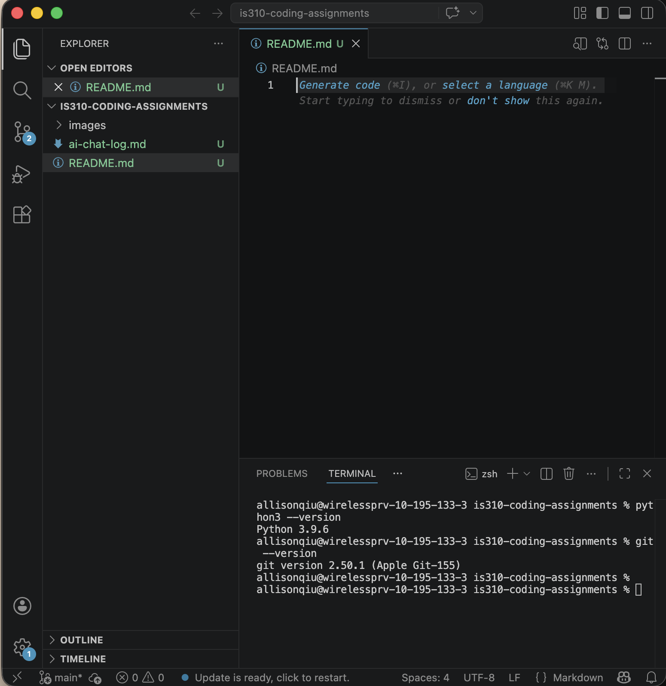
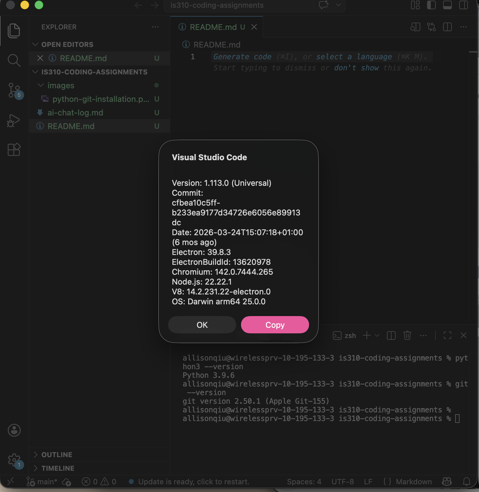

# IS310 Coding Assignments

## Installation Evidence

### Python and Git

I have Python 3.9.6 and Git 2.50.1 installed.

### Visual Studio Code

I have Visual Studio Code installed.

## Hypothesis

My Hypothesis username is: allisonqiu

## AI Tools

I use ChatGPT as an AI tool. I mainly use it to help explain coding concepts, understand errors, and walk me through unfamiliar coding processes. When using AI for course assignments, I will document relevant conversations in `ai-chat-log.md`.